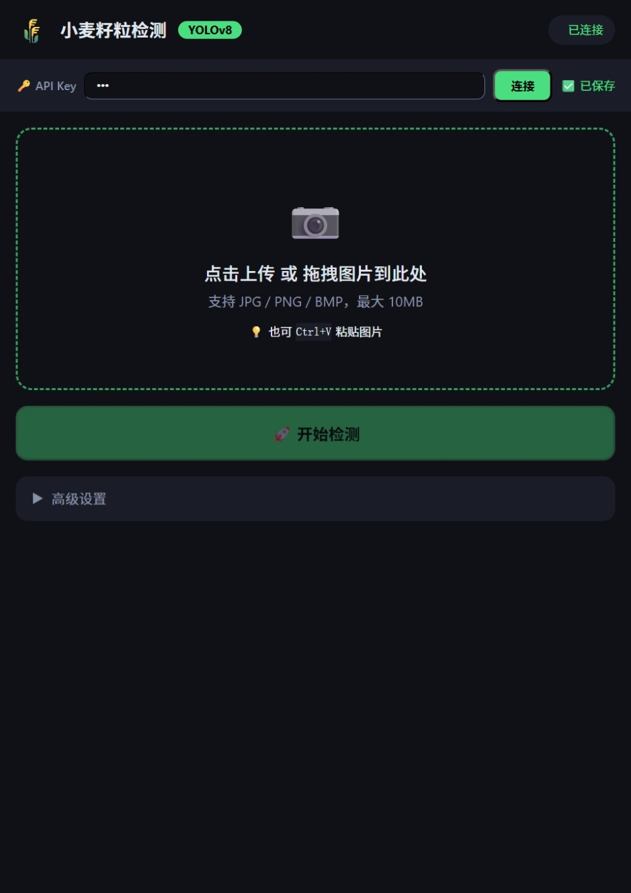
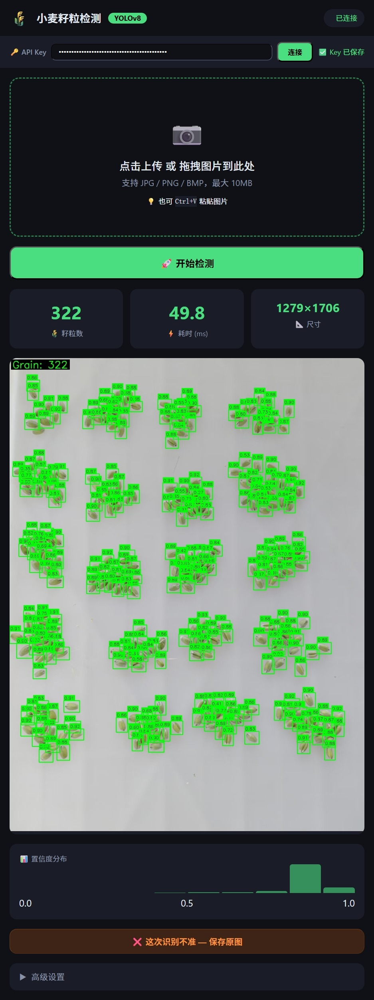
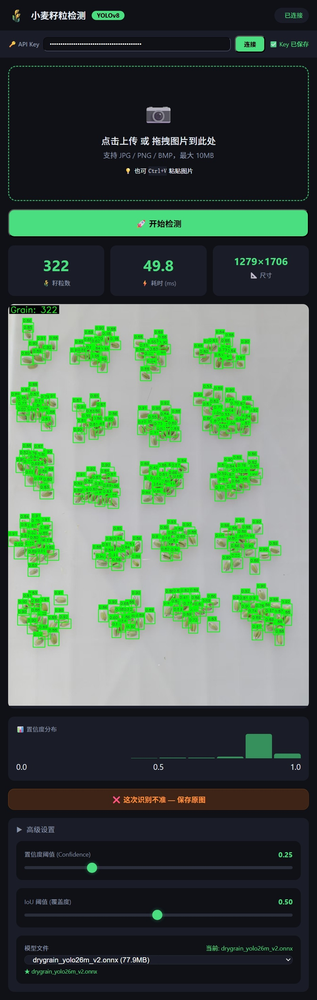

# 🌾 Grain Counter — 小麦籽粒检测 Web 服务

基于 YOLO ONNX 的小麦灌浆期籽粒自动检测与计数 Web 服务。支持手机/平板/桌面浏览器访问，提供 CLI 命令行工具供 AI Agent 调用。

---

## 快速开始

```bash
# 1. 安装依赖
pip install -r requirements.txt

# 2. 安装 CLI 工具（可选，推荐）
pip install -e agent-harness/

# 3. 下载模型文件放到 models/ 目录（见下方"模型下载"）

# 4. 启动管理面板（推荐新手）
python server_panel.py

# 5. 或直接启动 Web 服务器
python web_server.py --port 8000

# 6. 浏览器打开
# http://localhost:8000
```

首次启动会自动生成 API Key，在管理面板或终端可以看到。

---

## 模型下载

模型文件未包含在 Git 仓库中。将 `.onnx` 模型文件放入 `models/` 目录即可。

**支持的模型格式**：YOLO ONNX（YOLOv8/v9/v10/v11/v12/26m 等通用 YOLO 导出格式均可使用）。理论上所有 Ultralytics YOLO 系列导出的 ONNX 模型都支持，只需输入/输出张量格式兼容即可。

推荐模型：`drygrain_yolo26m_v2.onnx`（开源后提供下载链接）

---

## 使用方式

### 方式一：管理面板（桌面 GUI）

```bash
python server_panel.py
```

提供可视化管理界面：
- 一键启停 Web 服务器
- API Key 显示/复制/重新生成
- 端口配置 + 认证开关
- 在线设备列表（可踢出）
- 模型切换（下拉选择 models/ 目录下的 ONNX 文件）
- Cloudflared / Tailscale 状态检测与控制
- 实时日志面板
- 优质照片统计

### 方式二：命令行（CLI）

```bash
# 安装后可用四个命令
grain       # 主 CLI（检测、配置、模型管理、服务器管理、统计）
grainon     # 一键启动全栈（面板 + 服务器 + Cloudflared）
grainoff    # 一键停止全栈
grainkey    # 查看当前 API Key
```

#### grain 子命令

```bash
# 直接检测图片（不需要启动服务器）
grain detect image.jpg

# 批量检测
grain detect img1.jpg img2.jpg img3.jpg

# 服务器管理
grain server start      # 启动 Web 服务器
grain server stop       # 停止 Web 服务器
grain server status     # 查看服务器状态

# 配置管理
grain config show       # 查看当前配置
grain config set port 8080   # 修改端口
grain config set score_threshold 0.3  # 修改置信度阈值

# 模型管理
grain model list        # 列出可用模型
grain model switch drygrain_yolo26m_v2.onnx  # 切换模型

# 健康检查与统计
grain health            # 服务器健康状态
grain stats             # 检测统计（次数、平均耗时、错误数）
grain key show          # 显示 API Key
grain key regenerate    # 重新生成 API Key
```

#### 一键命令

```bash
grainon    # 依次启动：管理面板 → Web 服务器 → Cloudflared 隧道
grainoff   # 依次停止：Cloudflared → Web 服务器 → 管理面板
grainkey   # 打印当前 API Key
```

### 方式三：Web 界面

浏览器打开 `http://localhost:8000`。界面从上到下分为以下几个区域：



---

#### ① API Key 认证栏（页面最顶部）

页面顶部灰色横条，从左到右：
- **🔑 API Key 标签** — 提示这是认证输入区
- **密码输入框** — 输入 API Key（首次启动时自动生成，在终端或管理面板可见）
- **连接按钮** — 绿色，保存 Key 并连接服务器，成功后旁边显示 `✅ 已保存`
- 服务器启用认证时此栏可见，`--no-auth` 模式下自动隐藏

---

#### ② 图片上传区（页面中部）

虚线边框的大片区域，包含：
- 📷 图标 + "点击上传 或 拖拽图片到此处" 提示文字
- 支持 JPG / PNG / BMP，最大 10MB（可在 `config.yaml` 调整）
- 💡 也可 `Ctrl+V` 粘贴图片（截图后直接粘贴）
- >500KB 的图片自动压缩到 1920px 宽
- 上传成功后该区域变为图片预览

---

#### ③ 开始检测按钮（上传区下方）

- 🚀 **开始检测** — 绿色全宽按钮
- 未上传图片时：灰色禁用状态，不可点击
- 上传图片后：绿色可点击，按 `Enter` 键等效触发
- 点击后依次显示：上传进度条 → 加载旋转动画 + 骨架屏 → 结果面板

---

#### ④ 结果面板（检测完成后显示）



**顶部三个统计卡片（从左到右）：**
| 卡片 | 内容 |
|------|------|
| 🌾 籽粒数 | 检测到的籽粒总数，大号绿色字体 |
| ⚡ 耗时 (ms) | 服务器推理耗时，毫秒 |
| 📐 尺寸 | 图片分辨率（宽 × 高） |

**中部结果图片：**
- YOLO 标注框 + 置信度标签
- 鼠标悬停出现"点击查看大图"
- 点击进入全屏缩放模式：`ESC` 关闭，`+`/`-`/`0` 缩放，鼠标拖拽移动

**📊 置信度分布柱状图：**
- 展示所有检测框的置信度在 0.0 ~ 1.0 之间的分布情况

**底部 ❌ "这次识别不准 — 保存原图" 按钮：**
- 橙色按钮，点击将原图保存到 `Valuable photos/` 目录
- 用于收集低置信度样本，后续重新训练模型

---

#### ⑤ 重试按钮

- 🔄 检测失败时出现（网络错误 / 超时），点击重新检测
- 自动重试最多 3 次

---

#### ⑥ 高级设置（可折叠面板）



点击 **▶ 高级设置** 展开，包含：

| 控件 | 位置 | 功能 | 默认值 |
|------|------|------|--------|
| 置信度阈值 (Confidence) | 左侧滑块 | 过滤低置信度框，值越高结果越严格 | 0.25 |
| IoU 阈值 (覆盖度) | 右侧滑块 | 控制重叠框去重力度，值越高保留越多 | 0.50 |
| 模型文件 | 下方下拉框 | 切换 `models/` 目录下的 ONNX 模型文件 | 自动检测 |

滑块值实时显示，下次检测时生效。模型切换即时应用。

---

#### ⌨️ 键盘快捷键

| 操作 | 按键 |
|------|------|
| 触发检测 | `Enter` |
| 粘贴图片 | `Ctrl+V` |
| 关闭缩放 | `ESC` |
| 放大图片 | `+` |
| 缩小图片 | `-` |
| 适应屏幕 | `0` |

---

## 启动参数

```bash
python web_server.py --port 8080              # 指定端口
python web_server.py --no-auth                # 关闭认证（调试用）
python web_server.py --api-key my-custom-key  # 指定 API Key

# 管理面板
python server_panel.py --auto-start           # 启动面板同时自动启动服务器
```

---

## 配置说明

配置文件：`config.yaml`（提交到 Git）+ `config.local.yaml`（本地覆盖，不提交）

```yaml
# 服务器
port: 8000                    # 端口
host: "0.0.0.0"              # 监听地址
require_api_key: true         # 是否要求 API Key 认证

# 检测
model_path: models/drygrain_yolo26m_v2.onnx  # 模型文件路径
input_size: 640               # 模型输入尺寸
score_threshold: 0.25         # 置信度阈值
nms_threshold: 0.5            # NMS 阈值

# 上传限制
max_upload_mb: 10             # 最大上传文件大小（MB）
upload_timeout_seconds: 120   # 上传超时
inference_timeout_seconds: 300  # 推理超时

# 限速
rate_limit_per_minute: 60     # 每分钟最大请求数

# 优质照片筛选（保存低置信度图片用于模型优化）
valuable_dir: "Valuable photos"
valuable_enable: false
valuable_low_threshold: 0.5
valuable_very_low_threshold: 0.3

# 响应压缩（低带宽优化）
enable_response_compression: true
response_compress_min_size: 1000

# Cloudflared 隧道
tunnel_url: ""                # 留空，自动从 cloudflared 配置检测
```

> `config.local.yaml` 用于存放个人配置（如 `tunnel_url`），已被 `.gitignore` 排除，不会提交到 Git。

---

## API 接口

### 公开端点（无需认证）

| 路由 | 方法 | 说明 |
|------|------|------|
| `/` | GET | Web 前端页面 |
| `/api/health` | GET | 健康检查（模型、版本） |
| `/api/ping` | GET | 心跳检测（含认证状态） |
| `/api/config` | GET | 公开配置（上传限制、版本） |
| `/api/models` | GET | 可用模型列表 |

### 认证端点（需要 Bearer Token）

| 路由 | 方法 | 说明 |
|------|------|------|
| `/api/detect` | POST | 上传图片进行籽粒检测 |
| `/api/key` | GET | 获取 API Key |
| `/api/key/regenerate` | POST | 重新生成 API Key |
| `/api/toggle-auth` | POST | 切换认证开关 |
| `/api/stats` | GET | 检测统计 |
| `/api/select-model` | POST | 切换模型 |
| `/api/online-devices` | GET | 在线设备列表 |
| `/api/kick-device` | POST | 踢出指定设备 |
| `/api/valuable-stats` | GET | 优质照片统计 |
| `/api/valuable-toggle` | POST | 切换优质照片筛选 |
| `/api/valuable-reset` | POST | 重置照片计数 |
| `/api/valuable-open-dir` | POST | 打开照片目录 |

### 调用示例

```bash
# 获取 API Key
curl http://localhost:8000/api/key

# 图片检测
curl -X POST http://localhost:8000/api/detect \
  -H "Authorization: Bearer <API_KEY>" \
  -F "file=@wheat.jpg"

# 查看统计
curl -H "Authorization: Bearer <API_KEY>" \
  http://localhost:8000/api/stats
```

---

## 远程访问

### Cloudflared Tunnel

```bash
# 安装 cloudflared 并登录
cloudflared tunnel login

# 创建隧道
cloudflared tunnel create grain-counter

# 配置 DNS（在 Cloudflare Dashboard 中）
cloudflared tunnel route dns grain-counter your-domain.example.com

# 启动
cloudflared tunnel run grain-counter
```

管理面板会自动从 `~/.cloudflared/config.yml` 读取隧道 URL 并显示。

### Tailscale

```bash
tailscale up
```

管理面板会自动检测 Tailscale 状态并显示 Tailscale IP。其他设备可通过该 IP 访问。

---

## 安全特性

- **API Key 认证**：`secrets.token_urlsafe(32)` 生成，`secrets.compare_digest()` 防时序攻击
- **ScanGuard 扫描防护**：10 秒窗口内检测 15+ 不同路径或 50+ 总错误 → 自动进入保护模式
- **限速保护**：IP 级别限速，支持自动封禁
- **路径穿越防护**：模型选择接口禁止 `../` 路径
- **日志脱敏**：API Key 在日志中自动遮蔽
- **CORS 限制**：默认关闭跨域访问

---

## 项目结构

```
├── README.md
├── config.yaml               # 配置文件
├── requirements.txt          # Python 依赖
├── start_panel.sh            # Linux/macOS 启动脚本
├── 启动管理面板.bat           # Windows 启动脚本
├── web_server.py             # FastAPI 入口
├── server_panel.py           # 桌面管理面板（Tkinter）
├── test_verification.py      # 验证测试
├── graincounter/             # 核心包
│   ├── config.py             #   配置管理
│   ├── detector.py           #   YOLO ONNX 检测器
│   ├── guard.py              #   ScanGuard 扫描防护
│   ├── middleware.py          #   认证 + 限速中间件
│   ├── rate_limiter.py       #   IP 级别限速器
│   ├── device_tracker.py     #   在线设备追踪
│   ├── stats.py              #   检测统计
│   ├── valuable.py           #   优质照片筛选
│   ├── logger.py             #   日志系统
│   ├── state.py              #   集中应用状态
│   ├── user_agent.py         #   UA 解析
│   ├── theme.py / panel_ui.py / panel_controls.py  # 面板
│   └── routes/               #   API 路由
│       ├── detect.py         #     图片检测
│       ├── admin.py          #     管理接口
│       ├── models.py         #     模型管理
│       ├── devices.py        #     设备管理
│       └── pages.py          #     页面 + 优质照片
├── agent-harness/            # CLI 工具（AI Agent 接口）
│   ├── setup.py
│   └── cli_anything/graincounter/
├── templates/
│   └── index.html            # Web 前端
├── models/                   # 模型文件目录
└── Valuable photos/          # 优质照片存储目录
```

## 技术栈

- **后端**：Python 3.8+ / FastAPI / Uvicorn
- **推理**：ONNX Runtime（支持 CUDA / CPU）
- **模型**：Ultralytics YOLO 系列 ONNX 导出格式
- **前端**：原生 HTML/CSS/JS（无外部 CDN 依赖）
- **桌面面板**：Tkinter
- **图像处理**：OpenCV / NumPy / Pillow

## 版本历史

| 版本 | 日期 | 里程碑 |
|------|------|--------|
| v0.1.0 | 2026-04-27 | 初始原型 |
| v0.7.0 | 2026-05-03 | 低带宽优化、骨架屏 |
| v0.8.0 | 2026-05-11 | 项目重构、模块化 |
| v2.0.0 | 2026-05-15 | graincounter/ 包拆分 |
| v3.0.0 | 2026-05-17 | Cloudflared 隧道 |
| v4.1.0 | 2026-05-19 | CLI 工具 + 公开发布 |

共 20 个提交，完整演变历史见 `git log`。
