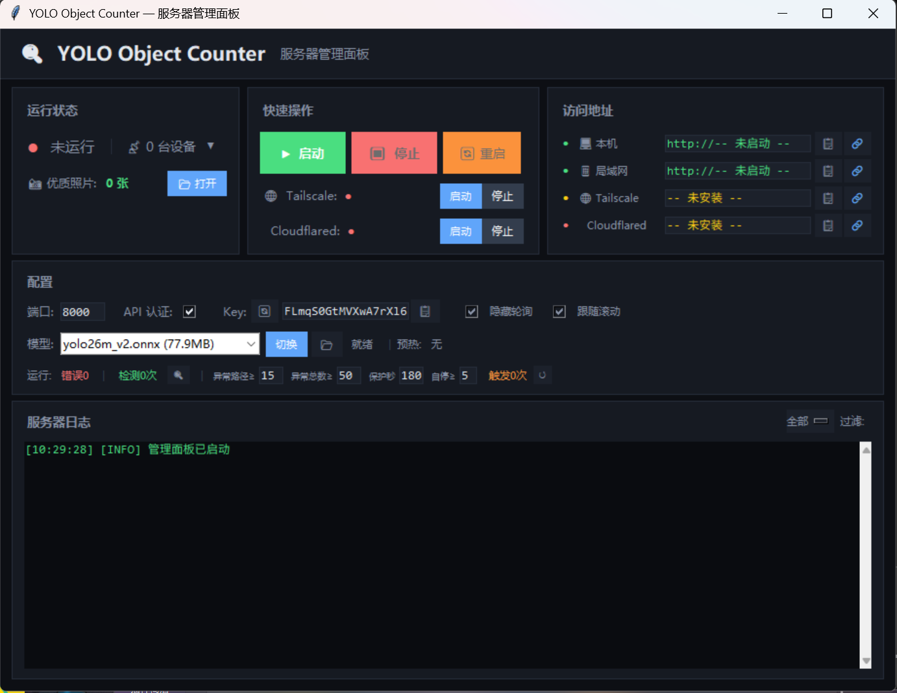
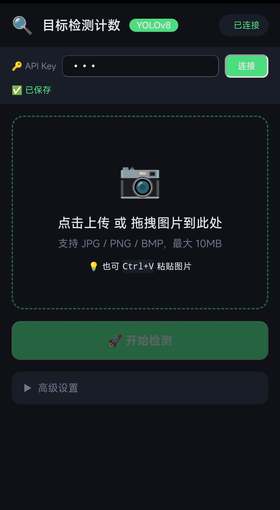
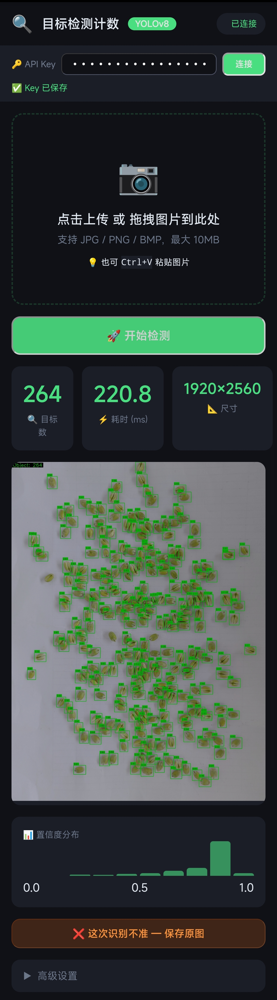

# 🔍 YOLO Object Counter

🌐 **[中文](README.md)**

A YOLO ONNX-based generic small object detection and counting web service. Accessible via browser (mobile/tablet/desktop), with CLI tools for AI Agent integration.

---

## Quick Start

```bash
# 1. Install dependencies
pip install -r requirements.txt

# 2. Install CLI tools (optional, recommended)
pip install -e agent-harness/

# 3. Download model files into models/ directory (see "Model Download" below)

# 4. Launch management panel (recommended for beginners)
python server_panel.py

# 5. Or start the web server directly
python web_server.py --port 8000

# 6. Open browser at http://localhost:8000
```

An API Key is auto-generated on first launch. You can view it in the management panel or terminal.

---

## Model Download

Model files are not included in the Git repository. Place `.onnx` model files in the `models/` directory.

**Supported formats**: YOLO ONNX (YOLOv8/v9/v10/v11/v12/26m and other standard YOLO export formats). Recommended model: `yolo26m_v2.onnx`

---

## Usage

### Option 1: Management Panel (Desktop GUI)

```bash
python server_panel.py
python server_panel.py --auto-start  # Auto-start server with panel
```

The management panel provides one-click start/stop, configuration management, real-time monitoring, model switching, and online device management.



### Option 2: Command Line (CLI)

```bash
# After installation, four commands are available
count       # Main CLI (detect, config, model, server, stats)
counton     # Start full stack (panel + server + Cloudflared)
countoff    # Stop full stack
countkey    # Show current API Key
```

```bash
count detect image.jpg           # Detect objects in image
count server start               # Start web server
count config show                # Show current config
count model list                 # List available models
count health                     # Server health status
```

### Option 3: Web Interface

Open `http://localhost:8000` in your browser.




Features:
- 📷 Image upload (drag & drop / paste / click to select)
- 🚀 One-click detection with real-time progress bars
- 📊 Confidence distribution histogram
- 🔍 Full-screen image zoom (drag, scroll wheel, touch gestures)
- ⚙️ Advanced settings: confidence threshold, IoU threshold, model switching
- 🌐 Chinese/English language switching (global setting)
- 💾 Low-confidence sample saving (for model optimization)

#### Keyboard Shortcuts

| Action | Key |
|--------|-----|
| Trigger detection | `Enter` |
| Paste image | `Ctrl+V` |
| Close zoom | `ESC` |
| Zoom in / out | `+` / `-` |
| Fit to screen | `0` |

---

## Launch Options

```bash
python web_server.py --port 8080              # Specify port
python web_server.py --no-auth                # Disable auth (for debugging)
python web_server.py --api-key my-custom-key  # Specify API Key
```

---

## Configuration

Configuration file: `config.yaml`

```yaml
port: 8000                          # Server port
host: "0.0.0.0"                     # Listen address
require_api_key: true               # Require API Key authentication
language: "zh"                      # Interface language (zh/en)

model_path: models/yolo26m_v2.onnx  # Model file path
input_size: 640                     # Model input size
score_threshold: 0.25               # Confidence threshold
nms_threshold: 0.5                  # NMS threshold

max_upload_mb: 10                   # Max upload size (MB)
rate_limit_per_minute: 60           # Max requests per minute

valuable_dir: "Valuable photos"     # Valuable photos directory
valuable_enable: false              # Enable valuable photo filtering

enable_response_compression: true   # Response compression
tunnel_url: ""                      # Cloudflared tunnel URL
```

> `config.local.yaml` can be used for personal overrides (excluded from Git via `.gitignore`).

---

## API Endpoints

### Public Endpoints

| Route | Method | Description |
|-------|--------|-------------|
| `/` | GET | Web frontend page |
| `/api/health` | GET | Health check |
| `/api/ping` | GET | Heartbeat |
| `/api/config` | GET | Public configuration |
| `/api/models` | GET | Available model list |

### Authenticated Endpoints (Bearer Token required)

| Route | Method | Description |
|-------|--------|-------------|
| `/api/detect` | POST | Upload image for object detection |
| `/api/language` | PUT | Switch interface language |
| `/api/key` | GET | Get API Key |
| `/api/key/regenerate` | POST | Regenerate API Key |
| `/api/toggle-auth` | POST | Toggle authentication |
| `/api/stats` | GET | Detection statistics |
| `/api/select-model` | POST | Switch model |
| `/api/online-devices` | GET | Online device list |
| `/api/kick-device` | POST | Kick device |
| `/api/valuable-stats` | GET | Valuable photo stats |
| `/api/valuable-toggle` | POST | Toggle valuable photo filtering |

### Examples

```bash
# Get API Key
curl http://localhost:8000/api/key

# Image detection
curl -X POST http://localhost:8000/api/detect \
  -H "Authorization: Bearer <API_KEY>" \
  -F "file=@sample.jpg"

# Switch language
curl -X PUT http://localhost:8000/api/language \
  -H "Authorization: Bearer <API_KEY>" \
  -H "Content-Type: application/json" \
  -d '{"language": "en"}'
```

---

## Remote Access

### Cloudflared Tunnel

```bash
cloudflared tunnel login
cloudflared tunnel create yolo-object-counter
cloudflared tunnel route dns yolo-object-counter your-domain.example.com
cloudflared tunnel run yolo-object-counter
```

### Tailscale

```bash
tailscale up
```

The management panel auto-detects Tailscale / Cloudflared status and displays access URLs.

---

## Security Features

- **API Key Authentication**: Generated with `secrets.token_urlsafe(32)`, timing-attack resistant
- **ScanGuard Protection**: Auto-enters protection mode on abnormal access patterns
- **Rate Limiting**: IP-level rate limiting with auto-ban
- **Path Traversal Protection**: Model selection endpoint blocks `../` paths
- **Log Sanitization**: API Keys are auto-masked in logs

---

## Project Structure

```
├── web_server.py             # FastAPI entry point
├── server_panel.py           # Desktop management panel (Tkinter)
├── config.yaml               # Configuration file
├── requirements.txt          # Python dependencies
├── objcounter/               # Core package
│   ├── config.py             #   Configuration management
│   ├── i18n.py               #   Internationalization
│   ├── detector.py           #   YOLO ONNX detector
│   ├── guard.py              #   ScanGuard protection
│   ├── middleware.py          #   Auth + rate limiting
│   ├── state.py              #   Application state
│   ├── routes/               #   API routes
│   │   ├── detect.py         #     Image detection
│   │   ├── admin.py          #     Admin endpoints
│   │   ├── models.py         #     Model management
│   │   ├── devices.py        #     Device management
│   │   └── pages.py          #     Pages + valuable photos
│   └── panel_ui.py / panel_controls.py  # Panel
├── templates/
│   └── index.html            # Web frontend
├── agent-harness/            # CLI tools
├── models/                   # Model files directory
└── Valuable photos/          # Valuable photos storage
```

## Tech Stack

- **Backend**: Python 3.8+ / FastAPI / Uvicorn
- **Inference**: ONNX Runtime (CUDA / CPU)
- **Models**: Ultralytics YOLO series ONNX export format
- **Frontend**: Vanilla HTML/CSS/JS (no external CDN dependencies)
- **Desktop Panel**: Tkinter / CustomTkinter
- **Image Processing**: OpenCV / NumPy

## Version History

| Version | Date | Milestone |
|---------|------|-----------|
| v0.1.0 | 2026-04-27 | Initial prototype |
| v0.7.0 | 2026-05-03 | Low-bandwidth optimization, skeleton screen |
| v0.8.0 | 2026-05-11 | Project refactoring, modularization |
| v2.0.0 | 2026-05-15 | objcounter/ package split |
| v3.0.0 | 2026-05-17 | Cloudflared tunnel |
| v4.1.0 | 2026-05-19 | CLI tools + public release |
| v5.0.0 | 2026-05-22 | Generic object counter refactor |
| v5.5.0 | 2026-05-26 | Chinese/English language switching |

## License

[PolyForm Noncommercial License 1.0.0](LICENSE) — Non-commercial use only.
